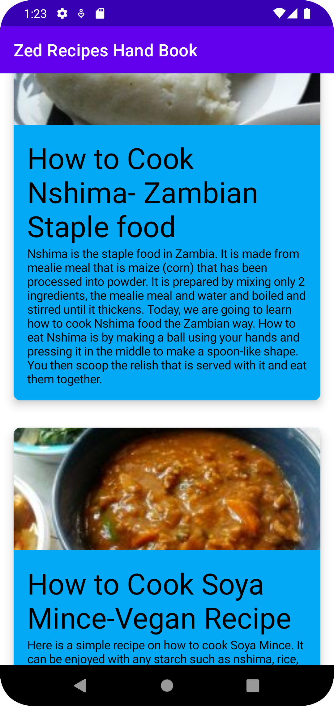
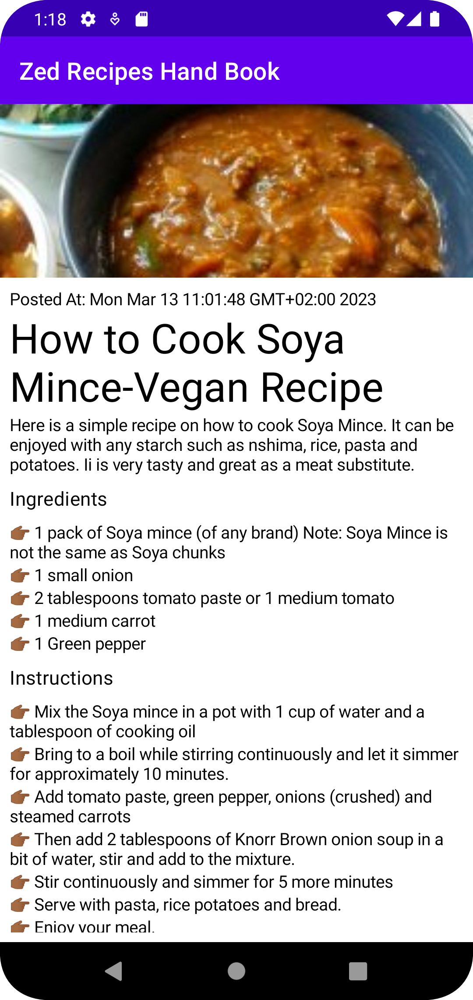

# Recipe App
Zed Recipe App is a simple Jetpack Compose Application that will help you understand how to make an 
API call using KTor in Android and how to handed Side Effects in a Composable function

o try out this sample app, use the latest stable version
of [Android Studio](https://developer.android.com/studio).
You can clone this repository or import the
project from Android Studio following the steps
[here](https://developer.android.com/jetpack/compose/setup#sample).

## Screenshots

  
### Credits
App Icon used was created by DinosoftLabs -  [Flaticon](https://www.flaticon.com/free-icons/kitchen)

The backend service is located on the [repo](https://github.com/paulouskunda/simple_recipe_api_kotlin)

You can check out the blog post for this app,

Happy Coding...
